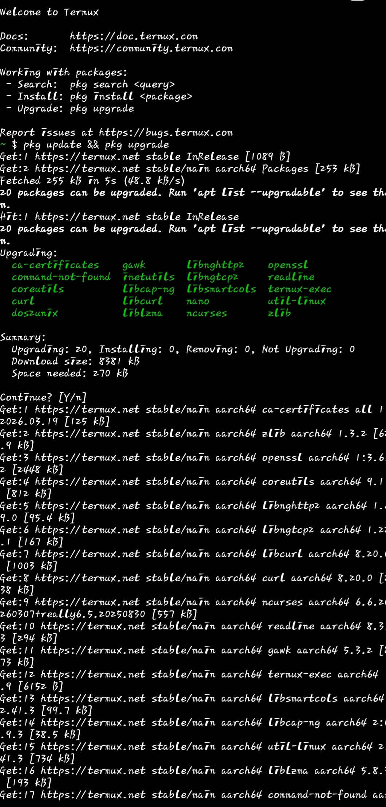

---
layout: default

title: Mapping Network Traffic with Wireshark

---

# Mapping Network Traffic with Wireshark 🕵️‍♂️

**Project Date:** May 2026

In this project, I used Wireshark to capture and analyze live network traffic to understand how data moves across a local network.

## 1. Capture Objectives
* Identify active protocols (TCP, HTTP, DNS).
* Analyze the "Three-Way Handshake" for secure connections.
* Detect any unencrypted (Plaintext) traffic.

## 2. Analysis & Findings
Using Wireshark's display filters, I was able to isolate specific traffic patterns:
* **Filter Used:** `ip.addr == [Your IP]`
* **Observation:** Successfully identified the sequence of SYN, SYN-ACK, and ACK packets.

## 3. Security Insight
Analyzing traffic with Wireshark is essential for detecting "Man-in-the-Middle" (MITM) attacks and unauthorized data exfiltration.

### 📱 Mobile Network Analysis Tools

On Android, I utilized a dual-tool approach to monitor system and network activity:

**1. System Monitoring (Termux):
I used `htop` to analyze background process behavior and resource allocation.

**2. Packet Inspection (PCAPdroid):**
Using a local VPN-loopback, I captured real-time traffic to identify which servers my mobile applications were communicating with.

### Case Study: Google Play Services Background Traffic
In this capture, I isolated the traffic from **Google Play Services**. 

**Analysis:**
* **Observation:** Constant background communication with Google's servers (APIs).
* **Protocol:** Heavily encrypted TLS traffic, ensuring user data privacy during transit.
* **Security Insight:** Monitoring these background services is crucial for detecting "anomalous heartbeats" which could indicate a compromised device or spyware masquerading as a system service.
* 
